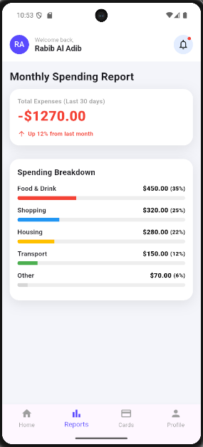

# Student Bank App

A comprehensive financial management application designed for students to manage their finances effectively.

## Features

- **Home Dashboard**:
  - View total balance and savings.
  - Quick actions: Transfer, Pay Bills, Invest.
  - Recent transactions list.
- **Spending Reports**:
  - Monthly spending overview.
  - Category-wise breakdown (Food, Shopping, Housing, etc.).
- **Card Management**:
  - View card details.
  - Manage card settings (Block, Details, Limit).
  - View linked accounts.
- **User Profile**:
  - View personal details (Name, ID, Email).
  - Bio/Story section.

## Screenshots

| Home Page | Reports Page |
| :---: | :---: |
|  |  |
| **Cards Page** | **Profile Page** |
|  |  |

## Installation

1. **Clone the repository:**
   ```bash
   git clone https://github.com/Rabib24/assignment-two-flutter-UI-Rabib-Al-Adib-2221005.git
   ```
2. **Navigate to the project directory:**
   ```bash
   cd student_bank_app
   ```
3. **Install dependencies:**
   ```bash
   flutter pub get
   ```
4. **Run the application:**
   ```bash
   flutter run
   ```

## Project Structure

```
student_bank_app/
├── android/            # Android platform-specific code
├── ios/                # iOS platform-specific code
├── lib/                # Main application code
│   ├── core/           # Core utilities
│   │   ├── theme/
│   │   │   ├── app_colors.dart
│   │   │   └── app_text_styles.dart
│   │   └── widgets/
│   │   │   ├── app_scaffold.dart
│   │   │   └── student_app_bar.dart
│   ├── features/       # App features
│   │   ├── cards/
│   │   │   └── cards_page.dart
│   │   ├── home/
│   │   │   └── home_page.dart
│   │   ├── profile/
│   │   │   └── profile_page.dart
│   │   └── reports/
│   │   │   └── reports_page.dart
│   └── main.dart       # Entry point
├── linux/              # Linux platform-specific code
├── macos/              # macOS platform-specific code
├── screenshots/        # Images used in README
├── test/               # Unit and widget tests
├── web/                # Web platform-specific code
├── windows/            # Windows platform-specific code
├── analysis_options.yaml # Linter rules
├── pubspec.yaml        # Project dependencies
└── README.md           # Project documentation
```

## Dependencies

- **Flutter SDK**: `^3.9.2`
- **cupertino_icons**: `^1.0.8`
- **flutter_lints**: `^5.0.0`

## Author

- **Name**: Rabib Al Adib
- **Student ID**: 2221005
- **Email**: 2221005@iub.edu.bd

## Getting Started

This project is a starting point for a Flutter application.

